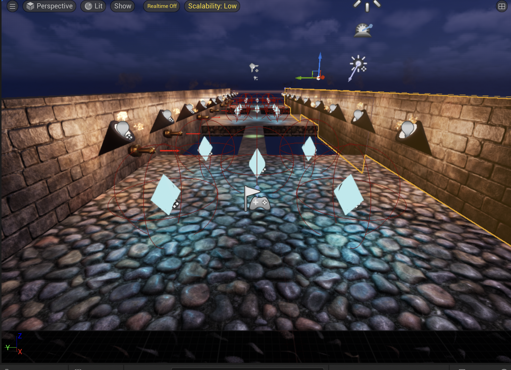
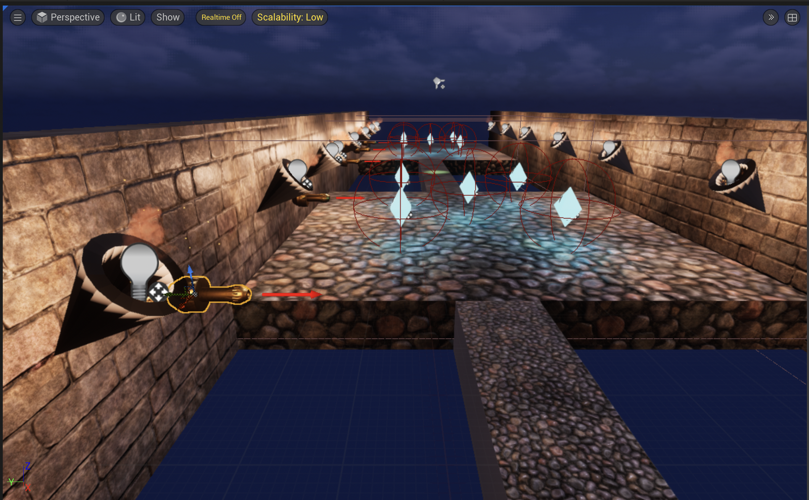

# Small Ball Adventure

Small Ball Adventure is my first game project. I built it independently in Unreal Engine 5.5 with Blueprint while learning how gameplay systems work together.

**[Watch the gameplay demo on YouTube](https://youtu.be/G0ebrOazVws)**

## Blueprint logic

**[Read the gameplay and Blueprint walkthrough](docs/blueprints/README.md)** — actual node connections, execution diagrams, input values and explanations for the main systems.

| System | Implementation |
| --- | --- |
| [Player](docs/blueprints/BA_Player.md) | Physics-based rolling, win-state input checks, camera setup, restart on damage |
| [Cannon](docs/blueprints/Cannon_Blueprint.md) / [projectile](docs/blueprints/cannon_bullet.md) | Repeating spawn loop, recoil timeline, collision and player damage |
| [Crystals](docs/blueprints/BP_cristal.md) | Timeline-driven movement, shrinking and light fade; count on completion |
| [Exit](docs/blueprints/Success_trigger.md) | Require all crystals, advance levels, set final win state |
| [UI](docs/blueprints/BP_UI.md) / [shared state](docs/blueprints/BP_GameInstance.md) | Collection counter, elapsed time and win feedback |
| [Reusable macros](docs/blueprints/NewMacroLibrary.md) / [fall trigger](docs/blueprints/BP_falltriger.md) | Player checks, camera fades and level restart |
| [Spotlight](docs/blueprints/BP_Spotlight_follow.md) | Smooth player tracking while inside its overlap area |

[What the files mean / 中文文件导览](docs/PROJECT-GUIDE-ZH.md)

## Screenshots

### Main obstacle course

### Cannons, collectibles, and platform section

## What I built

- Ball movement and player controls
- Automatic cannon firing, recoil animation and projectile hit detection
- Restart on damage or falling out of the course
- Animated crystal collection, exit checks and two-level progression
- A simple user interface and gameplay feedback
- Multiple test maps used while building and debugging features

## What I learned

This project taught me how to connect player input, actor behaviour, collisions, projectiles, UI, and level logic in Unreal. I also spent time fixing camera behaviour, collision problems, and Blueprint logic that did not behave as expected during playtests.

## Project structure

- `Content/blueprints/props` - player logic, UI, triggers, and interactive objects
- `Content/blueprints/hitwall` - early practice assets with unconnected event nodes
- `Content/Maps` - the main level and gameplay test maps
- `Config` - Unreal project and input settings
- `docs/blueprints` - browser-readable explanations and node references

## Running the project

The repository is a lightweight portfolio copy containing the main Blueprint and map files. It excludes Unreal Starter Content, third-party art, generated files, and caches. The included maps may reference assets that are not in this repository, so the gameplay video is the best way to view the finished project.

## Tools

- Unreal Engine 5.5
- Blueprint visual scripting

## Assets

The environment uses materials and base assets from Unreal Engine Starter Content. Those source assets are not included in this repository. I built the Blueprint gameplay logic and assembled the level shown in the demo and screenshots.

## Author

Gavin Lei  
Computer Science student at the University of British Columbia
