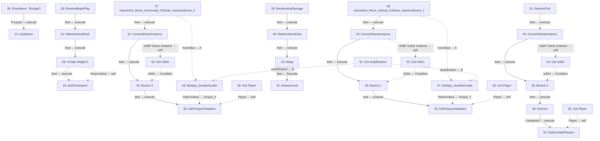
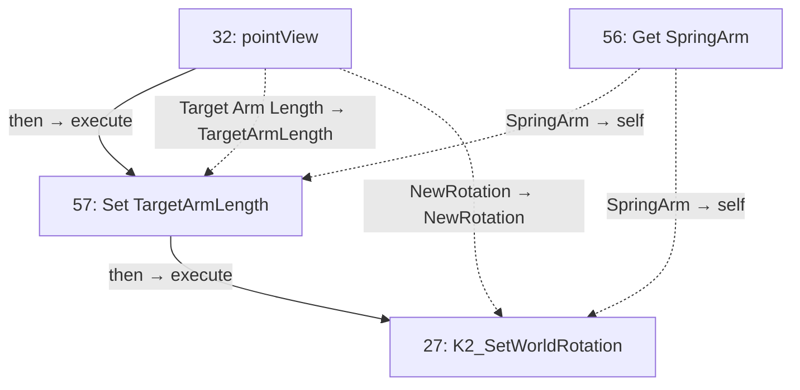

# BA_Player

Player movement, camera setup, damage and win response.

[Back to walkthrough](README.md) · [Open Blueprint asset](../../Content/blueprints/props/BA_Player.uasset)

The node IDs below are export indices in this saved asset. Diagrams are reconstructed from serialized Blueprint pin links, not Unreal Editor screenshots. Solid arrows show execution; dotted arrows show data. Empty event nodes remain visible in the tables.

## EventGraph

| ID | Node | Connected inputs and stored defaults | Outputs |
| --- | --- | --- | --- |
| 21 | `QuitGame` | `execute` ← #39 `Pressed` `QuitPreference` = `Quit` `bIgnorePlatformRestrictions` = `false` | Unconnected |
| 22 | `AddToViewport` | `execute` ← #28 `then` `self` ← #28 `ReturnValue` `ZOrder` = `0` | Unconnected |
| 23 | `Delay` | `execute` ← #40 `then` `Duration` = `1.000000` | `then` → #42 `Execute` |
| 24 | `SetSimulatePhysics` | `execute` ← #46 `Completed` `self` ← #55 `Player` `bSimulate` = `false` | Unconnected |
| 25 | `AddTorqueInRadians` | `execute` ← #34 `else` `self` ← #49 `Player` `Torque` = `0, 0, 0` `Torque_X` ← #48 `ReturnValue` `Torque_Y` = `0.0` `Torque_Z` = `0.0` `BoneName` = `None` `bAccelChange` = `true` | Unconnected |
| 26 | `AddTorqueInRadians` | `execute` ← #35 `else` `self` ← #50 `Player` `Torque` = `0, 0, 0` `Torque_X` = `0.0` `Torque_Y` ← #47 `ReturnValue` `Torque_Z` = `0.0` `BoneName` = `None` `bAccelChange` = `true` | Unconnected |
| 28 | `Create Widget 0` | `execute` ← #41 `then` `Class` = `BP_UI_C` | `then` → #22 `execute` `ReturnValue` → #22 `self` |
| 29 | `ReceiveBeginPlay` | — | `then` → #41 `execute` |
| 30 | `ReceiveAnyDamage` | — | `then` → #40 `execute` |
| 31 | `ReceiveTick` | — | `then` → #45 `execute` |
| 34 | `Branch 0` | `execute` ← #43 `then` `Condition` ← #52 `IsWin` | `else` → #25 `execute` |
| 35 | `Branch 1` | `execute` ← #44 `then` `Condition` ← #53 `IsWin` | `else` → #26 `execute` |
| 36 | `Branch 2` | `execute` ← #45 `then` `Condition` ← #54 `IsWin` | `then` → #46 `execute` |
| 37 | `InpAxisEvt_Move_Horrizontal_K2Node_InputAxisEvent_0` | — | `then` → #43 `execute` `AxisValue` → #48 `A` |
| 38 | `InpAxisEvt_Move_Vertical_K2Node_InputAxisEvent_1` | — | `then` → #44 `execute` `AxisValue` → #47 `A` |
| 39 | `{'KeyName': 'Escape'}` | — | `Pressed` → #21 `execute` |
| 40 | `MakeCameraDark` | `execute` ← #30 `then` `ToAlpha` = `1.000000` `Duration` = `1.000000` `bHoldWhenFinished` = `true` | `then` → #23 `execute` |
| 41 | `MakeCameraDark` | `execute` ← #29 `then` `FromAlpha` = `1.000000` `Duration` = `1.000000` `bHoldWhenFinished` = `true` | `then` → #28 `execute` |
| 42 | `RestartLevel` | `Execute` ← #23 `then` | Unconnected |
| 43 | `ConvertGameInstance` | `execute` ← #37 `then` | `then` → #34 `execute` `AsBP Game Instance` → #52 `self` |
| 44 | `ConvertGameInstance` | `execute` ← #38 `then` | `then` → #35 `execute` `AsBP Game Instance` → #53 `self` |
| 45 | `ConvertGameInstance` | `execute` ← #31 `then` | `then` → #36 `execute` `AsBP Game Instance` → #54 `self` |
| 46 | `DoOnce` | `execute` ← #36 `then` | `Completed` → #24 `execute` |
| 47 | `Multiply_DoubleDouble` | `A` ← #38 `AxisValue` `B` ← #51 `amplification` | `ReturnValue` → #26 `Torque_Y` |
| 48 | `Multiply_DoubleDouble` | `A` ← #37 `AxisValue` `B` ← #51 `amplification` | `ReturnValue` → #25 `Torque_X` |
| 49 | `Get Player` | — | `Player` → #25 `self` |
| 50 | `Get Player` | — | `Player` → #26 `self` |
| 51 | `Get amplification` | — | `amplification` → #48 `B`, #47 `B` |
| 52 | `Get IsWin` | `self` ← #43 `AsBP Game Instance` | `IsWin` → #34 `Condition` |
| 53 | `Get IsWin` | `self` ← #44 `AsBP Game Instance` | `IsWin` → #35 `Condition` |
| 54 | `Get IsWin` | `self` ← #45 `AsBP Game Instance` | `IsWin` → #36 `Condition` |
| 55 | `Get Player` | — | `Player` → #24 `self` |

## pointView

| ID | Node | Connected inputs and stored defaults | Outputs |
| --- | --- | --- | --- |
| 27 | `K2_SetWorldRotation` | `execute` ← #57 `then` `self` ← #56 `SpringArm` `NewRotation` ← #32 `NewRotation` `bSweep` = `false` `bTeleport` = `false` | Unconnected |
| 32 | `pointView` | — | `then` → #57 `execute` `Target Arm Length` → #57 `TargetArmLength` `NewRotation` → #27 `NewRotation` |
| 56 | `Get SpringArm` | — | `SpringArm` → #57 `self`, #27 `self` |
| 57 | `Set TargetArmLength` | `execute` ← #32 `then` `TargetArmLength` ← #32 `Target Arm Length` `self` ← #56 `SpringArm` | `then` → #27 `execute` |

## UserConstructionScript

No connected node flow in this graph.

| ID | Node | Connected inputs and stored defaults | Outputs |
| --- | --- | --- | --- |
| 33 | `UserConstructionScript` | — | Unconnected |

## Reading this export

A connected input gets its value from the linked node; its unused editor default is not shown in the table. Class defaults can be overridden by placed actors in a map. A disconnected output does not execute another node. This is a static graph inspection, not a runtime test.
