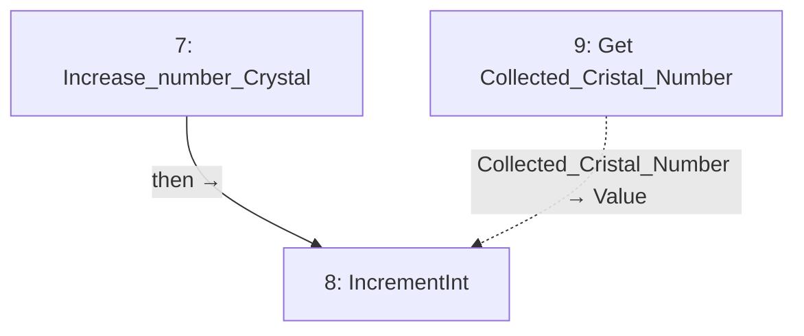

# BP_GameInstance

Shared crystal count, elapsed time and win state.

[Back to walkthrough](README.md) · [Open Blueprint asset](../../Content/blueprints/props/BP_GameInstance.uasset)

The node IDs below are export indices in this saved asset. Diagrams are reconstructed from serialized Blueprint pin links, not Unreal Editor screenshots. Solid arrows show execution; dotted arrows show data. Empty event nodes remain visible in the tables.

## Increase_number_Crystal

| ID | Node | Connected inputs and stored defaults | Outputs |
| --- | --- | --- | --- |
| 7 | `Increase_number_Crystal` | — | `then` → #8 ` ` |
| 8 | `IncrementInt` | ` ` ← #7 `then` `Value` ← #9 `Collected_Cristal_Number` | Unconnected |
| 9 | `Get Collected_Cristal_Number` | — | `Collected_Cristal_Number` → #8 `Value` |

## Reading this export

A connected input gets its value from the linked node; its unused editor default is not shown in the table. Class defaults can be overridden by placed actors in a map. A disconnected output does not execute another node. This is a static graph inspection, not a runtime test.
