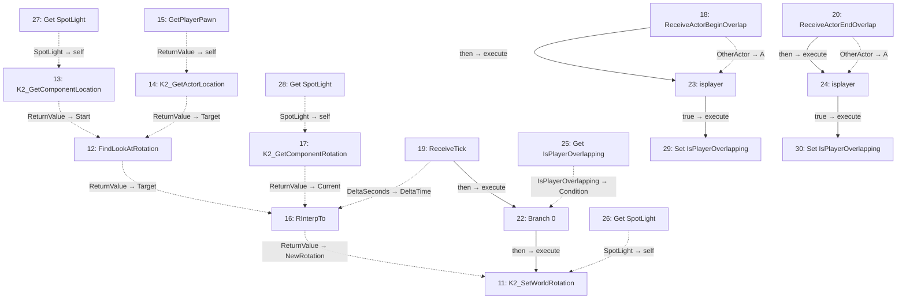

# BP_Spotlight_follow

Smooth spotlight tracking inside a trigger.

[Back to walkthrough](README.md) · [Open Blueprint asset](../../Content/blueprints/props/BP_Spotlight_follow.uasset)

The node IDs below are export indices in this saved asset. Diagrams are reconstructed from serialized Blueprint pin links, not Unreal Editor screenshots. Solid arrows show execution; dotted arrows show data. Empty event nodes remain visible in the tables.

## EventGraph

| ID | Node | Connected inputs and stored defaults | Outputs |
| --- | --- | --- | --- |
| 11 | `K2_SetWorldRotation` | `execute` ← #22 `then` `self` ← #26 `SpotLight` `NewRotation` ← #16 `ReturnValue` `bSweep` = `false` `bTeleport` = `false` | Unconnected |
| 12 | `FindLookAtRotation` | `Start` ← #13 `ReturnValue` `Target` ← #14 `ReturnValue` | `ReturnValue` → #16 `Target` |
| 13 | `K2_GetComponentLocation` | `self` ← #27 `SpotLight` | `ReturnValue` → #12 `Start` |
| 14 | `K2_GetActorLocation` | `self` ← #15 `ReturnValue` | `ReturnValue` → #12 `Target` |
| 15 | `GetPlayerPawn` | `PlayerIndex` = `0` | `ReturnValue` → #14 `self` |
| 16 | `RInterpTo` | `Current` ← #17 `ReturnValue` `Target` ← #12 `ReturnValue` `DeltaTime` ← #19 `DeltaSeconds` `InterpSpeed` = `5.000000` | `ReturnValue` → #11 `NewRotation` |
| 17 | `K2_GetComponentRotation` | `self` ← #28 `SpotLight` | `ReturnValue` → #16 `Current` |
| 18 | `ReceiveActorBeginOverlap` | — | `then` → #23 `execute` `OtherActor` → #23 `A` |
| 19 | `ReceiveTick` | — | `then` → #22 `execute` `DeltaSeconds` → #16 `DeltaTime` |
| 20 | `ReceiveActorEndOverlap` | — | `then` → #24 `execute` `OtherActor` → #24 `A` |
| 22 | `Branch 0` | `execute` ← #19 `then` `Condition` ← #25 `IsPlayerOverlapping` | `then` → #11 `execute` |
| 23 | `isplayer` | `execute` ← #18 `then` `A` ← #18 `OtherActor` | `true` → #29 `execute` |
| 24 | `isplayer` | `execute` ← #20 `then` `A` ← #20 `OtherActor` | `true` → #30 `execute` |
| 25 | `Get IsPlayerOverlapping` | — | `IsPlayerOverlapping` → #22 `Condition` |
| 26 | `Get SpotLight` | — | `SpotLight` → #11 `self` |
| 27 | `Get SpotLight` | — | `SpotLight` → #13 `self` |
| 28 | `Get SpotLight` | — | `SpotLight` → #17 `self` |
| 29 | `Set IsPlayerOverlapping` | `execute` ← #23 `true` `IsPlayerOverlapping` = `true` | Unconnected |
| 30 | `Set IsPlayerOverlapping` | `execute` ← #24 `true` `IsPlayerOverlapping` = `false` | Unconnected |

## UserConstructionScript

No connected node flow in this graph.

| ID | Node | Connected inputs and stored defaults | Outputs |
| --- | --- | --- | --- |
| 21 | `UserConstructionScript` | — | Unconnected |

## Reading this export

A connected input gets its value from the linked node; its unused editor default is not shown in the table. Class defaults can be overridden by placed actors in a map. A disconnected output does not execute another node. This is a static graph inspection, not a runtime test.
