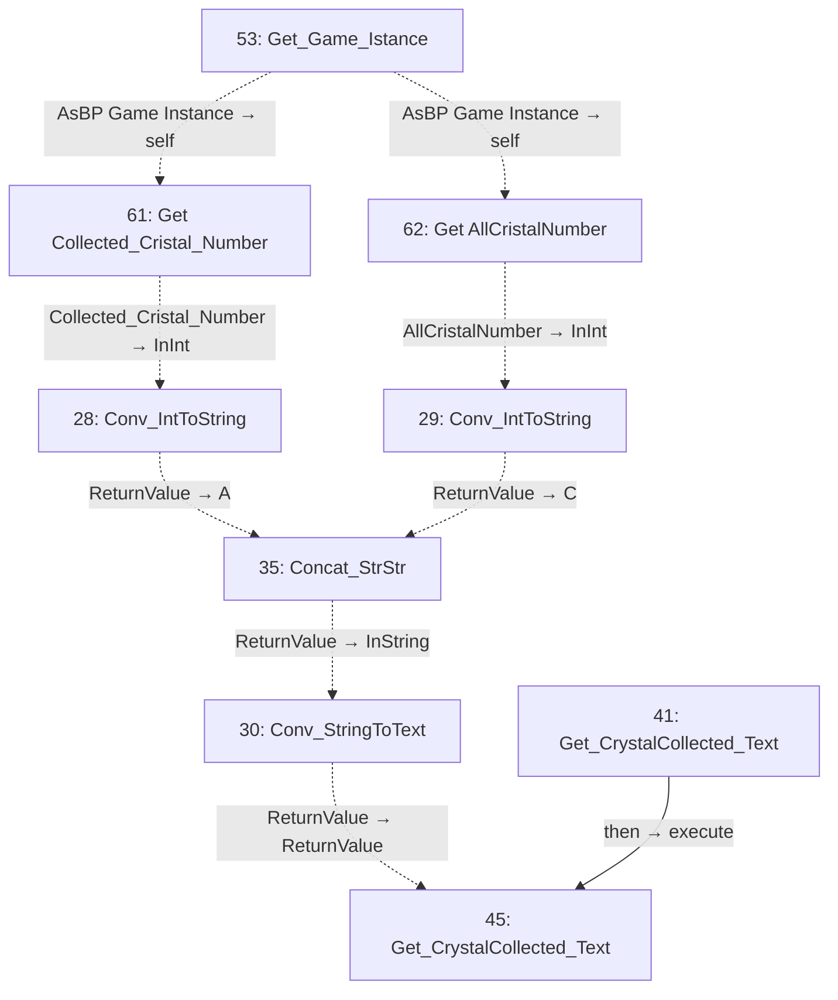
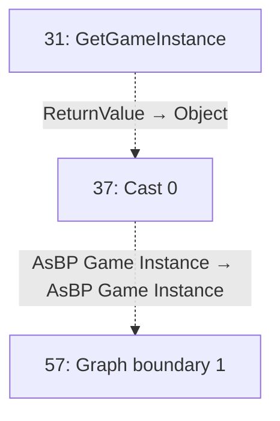
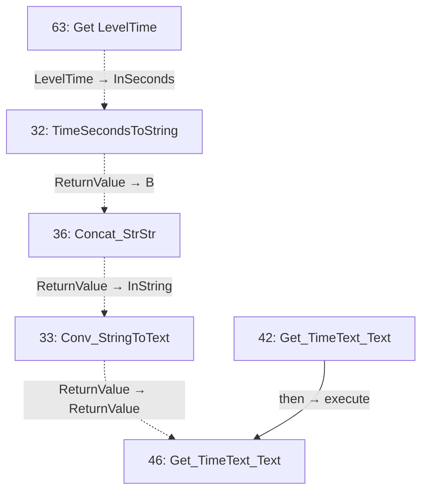
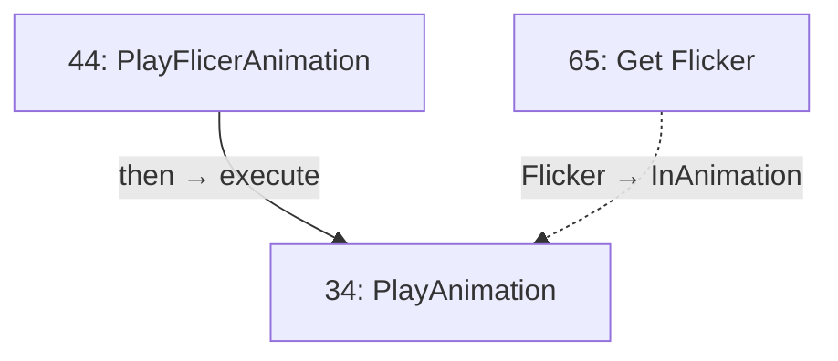
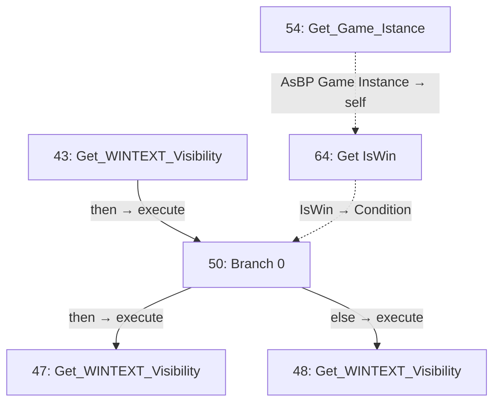

# BP_UI

Crystal counter, timer and win feedback.

[Back to walkthrough](README.md) · [Open Blueprint asset](../../Content/blueprints/props/BP_UI.uasset)

The node IDs below are export indices in this saved asset. Diagrams are reconstructed from serialized Blueprint pin links, not Unreal Editor screenshots. Solid arrows show execution; dotted arrows show data. Empty event nodes remain visible in the tables.

## EventGraph

```mermaid
flowchart TD
  n27["27: GetCurrentLevelName"]
  n39["39: Construct"]
  n40["40: Tick"]
  n49["49: Branch 0"]
  n51["51: Get_Game_Istance"]
  n52["52: Get_Game_Istance"]
  n55["55: Add_DoubleDouble"]
  n58["58: Get LevelTime"]
  n59["59: Get GameTime"]
  n60["60: Get IsWin"]
  n66["66: Set LevelName"]
  n67["67: Set LevelTime"]
  n68["68: Set LevelTime"]
  n27 -->|"then → execute"| n66
  n27 -.->|"ReturnValue → LevelName"| n66
  n39 -->|"then → execute"| n27
  n40 -->|"then → execute"| n49
  n40 -.->|"InDeltaTime → A"| n55
  n49 -->|"else → execute"| n67
  n51 -.->|"AsBP Game Instance → self"| n59
  n52 -.->|"AsBP Game Instance → self"| n60
  n55 -.->|"ReturnValue → LevelTime"| n67
  n58 -.->|"LevelTime → B"| n55
  n59 -.->|"GameTime → LevelTime"| n68
  n60 -.->|"IsWin → Condition"| n49
  n66 -->|"then → execute"| n68
```

| ID | Node | Connected inputs and stored defaults | Outputs |
| --- | --- | --- | --- |
| 27 | `GetCurrentLevelName` | `execute` ← #39 `then` `bRemovePrefixString` = `true` | `then` → #66 `execute` `ReturnValue` → #66 `LevelName` |
| 38 | `PreConstruct` | — | Unconnected |
| 39 | `Construct` | — | `then` → #27 `execute` |
| 40 | `Tick` | — | `then` → #49 `execute` `InDeltaTime` → #55 `A` |
| 49 | `Branch 0` | `execute` ← #40 `then` `Condition` ← #60 `IsWin` | `else` → #67 `execute` |
| 51 | `Get_Game_Istance` | — | `AsBP Game Instance` → #59 `self` |
| 52 | `Get_Game_Istance` | — | `AsBP Game Instance` → #60 `self` |
| 55 | `Add_DoubleDouble` | `A` ← #40 `InDeltaTime` `B` ← #58 `LevelTime` | `ReturnValue` → #67 `LevelTime` |
| 58 | `Get LevelTime` | — | `LevelTime` → #55 `B` |
| 59 | `Get GameTime` | `self` ← #51 `AsBP Game Instance` | `GameTime` → #68 `LevelTime` |
| 60 | `Get IsWin` | `self` ← #52 `AsBP Game Instance` | `IsWin` → #49 `Condition` |
| 66 | `Set LevelName` | `execute` ← #27 `then` `LevelName` ← #27 `ReturnValue` | `then` → #68 `execute` |
| 67 | `Set LevelTime` | `execute` ← #49 `else` `LevelTime` ← #55 `ReturnValue` | Unconnected |
| 68 | `Set LevelTime` | `execute` ← #66 `then` `LevelTime` ← #59 `GameTime` | Unconnected |

## Get_CrystalCollected_Text

| ID | Node | Connected inputs and stored defaults | Outputs |
| --- | --- | --- | --- |
| 28 | `Conv_IntToString` | `InInt` ← #61 `Collected_Cristal_Number` | `ReturnValue` → #35 `A` |
| 29 | `Conv_IntToString` | `InInt` ← #62 `AllCristalNumber` | `ReturnValue` → #35 `C` |
| 30 | `Conv_StringToText` | `InString` ← #35 `ReturnValue` | `ReturnValue` → #45 `ReturnValue` |
| 35 | `Concat_StrStr` | `A` ← #28 `ReturnValue` `B` = `/` `C` ← #29 `ReturnValue` | `ReturnValue` → #30 `InString` |
| 41 | `Get_CrystalCollected_Text` | — | `then` → #45 `execute` |
| 45 | `Get_CrystalCollected_Text` | `execute` ← #41 `then` `ReturnValue` ← #30 `ReturnValue` | Unconnected |
| 53 | `Get_Game_Istance` | — | `AsBP Game Instance` → #61 `self`, #62 `self` |
| 61 | `Get Collected_Cristal_Number` | `self` ← #53 `AsBP Game Instance` | `Collected_Cristal_Number` → #28 `InInt` |
| 62 | `Get AllCristalNumber` | `self` ← #53 `AsBP Game Instance` | `AllCristalNumber` → #29 `InInt` |

## Get_Game_Istance

| ID | Node | Connected inputs and stored defaults | Outputs |
| --- | --- | --- | --- |
| 31 | `GetGameInstance` | — | `ReturnValue` → #37 `Object` |
| 37 | `Cast 0` | `Object` ← #31 `ReturnValue` | `AsBP Game Instance` → #57 `AsBP Game Instance` |
| 56 | `Graph boundary 0` | — | Unconnected |
| 57 | `Graph boundary 1` | `AsBP Game Instance` ← #37 `AsBP Game Instance` | Unconnected |

## Get_TimeText_Text

| ID | Node | Connected inputs and stored defaults | Outputs |
| --- | --- | --- | --- |
| 32 | `TimeSecondsToString` | `InSeconds` ← #63 `LevelTime` | `ReturnValue` → #36 `B` |
| 33 | `Conv_StringToText` | `InString` ← #36 `ReturnValue` | `ReturnValue` → #46 `ReturnValue` |
| 36 | `Concat_StrStr` | `A` = `Time: ` `B` ← #32 `ReturnValue` | `ReturnValue` → #33 `InString` |
| 42 | `Get_TimeText_Text` | — | `then` → #46 `execute` |
| 46 | `Get_TimeText_Text` | `execute` ← #42 `then` `ReturnValue` ← #33 `ReturnValue` | Unconnected |
| 63 | `Get LevelTime` | — | `LevelTime` → #32 `InSeconds` |

## PlayFlicerAnimation

| ID | Node | Connected inputs and stored defaults | Outputs |
| --- | --- | --- | --- |
| 34 | `PlayAnimation` | `execute` ← #44 `then` `InAnimation` ← #65 `Flicker` `StartAtTime` = `0.000000` `NumLoopsToPlay` = `1` `PlayMode` = `Forward` `PlaybackSpeed` = `1.000000` `bRestoreState` = `false` | Unconnected |
| 44 | `PlayFlicerAnimation` | — | `then` → #34 `execute` |
| 65 | `Get Flicker` | — | `Flicker` → #34 `InAnimation` |

## Get_WINTEXT_Visibility

| ID | Node | Connected inputs and stored defaults | Outputs |
| --- | --- | --- | --- |
| 43 | `Get_WINTEXT_Visibility` | — | `then` → #50 `execute` |
| 47 | `Get_WINTEXT_Visibility` | `execute` ← #50 `then` `ReturnValue` = `Visible` | Unconnected |
| 48 | `Get_WINTEXT_Visibility` | `execute` ← #50 `else` `ReturnValue` = `Hidden` | Unconnected |
| 50 | `Branch 0` | `execute` ← #43 `then` `Condition` ← #64 `IsWin` | `then` → #47 `execute` `else` → #48 `execute` |
| 54 | `Get_Game_Istance` | — | `AsBP Game Instance` → #64 `self` |
| 64 | `Get IsWin` | `self` ← #54 `AsBP Game Instance` | `IsWin` → #50 `Condition` |

## Reading this export

A connected input gets its value from the linked node; its unused editor default is not shown in the table. Class defaults can be overridden by placed actors in a map. A disconnected output does not execute another node. This is a static graph inspection, not a runtime test.
