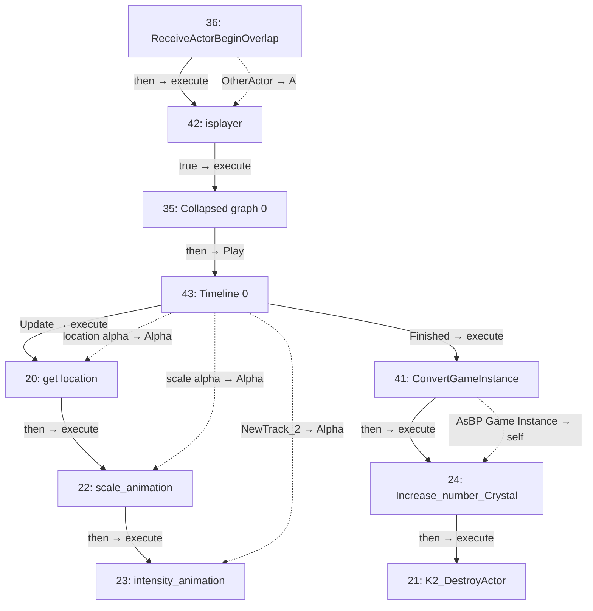
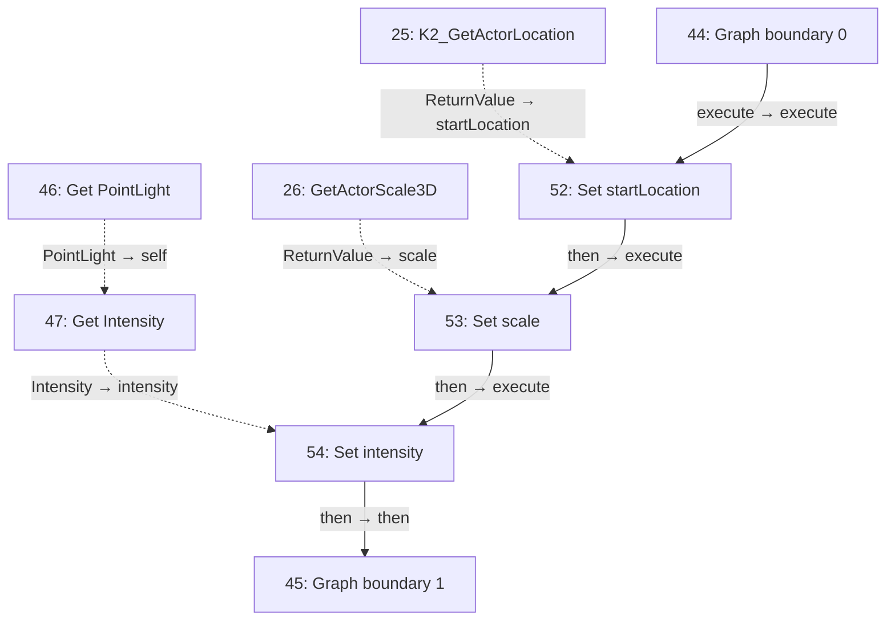
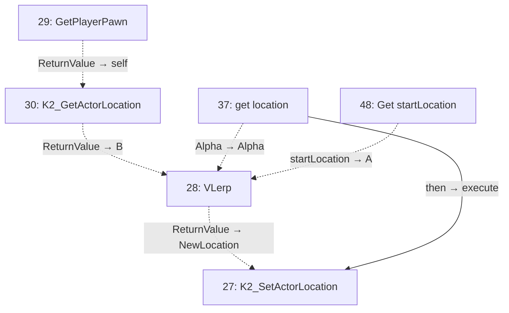
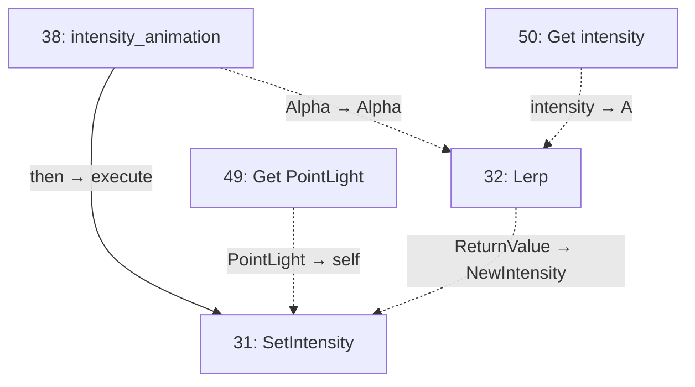
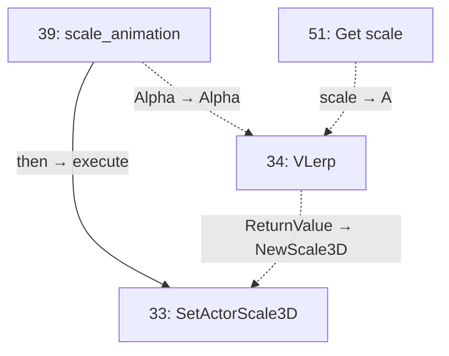

# BP_cristal

Crystal collection and animation.

[Back to walkthrough](README.md) · [Open Blueprint asset](../../Content/blueprints/props/BP_cristal.uasset)

The node IDs below are export indices in this saved asset. Diagrams are reconstructed from serialized Blueprint pin links, not Unreal Editor screenshots. Solid arrows show execution; dotted arrows show data. Empty event nodes remain visible in the tables.

## EventGraph

| ID | Node | Connected inputs and stored defaults | Outputs |
| --- | --- | --- | --- |
| 20 | `get location` | `execute` ← #43 `Update` `Alpha` ← #43 `location alpha` | `then` → #22 `execute` |
| 21 | `K2_DestroyActor` | `execute` ← #24 `then` | Unconnected |
| 22 | `scale_animation` | `execute` ← #20 `then` `Alpha` ← #43 `scale alpha` | `then` → #23 `execute` |
| 23 | `intensity_animation` | `execute` ← #22 `then` `Alpha` ← #43 `NewTrack_2` | Unconnected |
| 24 | `Increase_number_Crystal` | `execute` ← #41 `then` `self` ← #41 `AsBP Game Instance` | `then` → #21 `execute` |
| 35 | `Collapsed graph 0` | `execute` ← #42 `true` | `then` → #43 `Play` |
| 36 | `ReceiveActorBeginOverlap` | — | `then` → #42 `execute` `OtherActor` → #42 `A` |
| 41 | `ConvertGameInstance` | `execute` ← #43 `Finished` | `then` → #24 `execute` `AsBP Game Instance` → #24 `self` |
| 42 | `isplayer` | `execute` ← #36 `then` `A` ← #36 `OtherActor` | `true` → #35 `execute` |
| 43 | `Timeline 0` | `Play` ← #35 `then` `NewTime` = `0.0` | `Update` → #20 `execute` `Finished` → #41 `execute` `location alpha` → #20 `Alpha` `scale alpha` → #22 `Alpha` `NewTrack_2` → #23 `Alpha` |

## CollapseGraph

| ID | Node | Connected inputs and stored defaults | Outputs |
| --- | --- | --- | --- |
| 25 | `K2_GetActorLocation` | — | `ReturnValue` → #52 `startLocation` |
| 26 | `GetActorScale3D` | — | `ReturnValue` → #53 `scale` |
| 44 | `Graph boundary 0` | — | `execute` → #52 `execute` |
| 45 | `Graph boundary 1` | `then` ← #54 `then` | Unconnected |
| 46 | `Get PointLight` | — | `PointLight` → #47 `self` |
| 47 | `Get Intensity` | `self` ← #46 `PointLight` | `Intensity` → #54 `intensity` |
| 52 | `Set startLocation` | `execute` ← #44 `execute` `startLocation` ← #25 `ReturnValue` | `then` → #53 `execute` |
| 53 | `Set scale` | `execute` ← #52 `then` `scale` ← #26 `ReturnValue` | `then` → #54 `execute` |
| 54 | `Set intensity` | `execute` ← #53 `then` `intensity` ← #47 `Intensity` | `then` → #45 `then` |

## get location

| ID | Node | Connected inputs and stored defaults | Outputs |
| --- | --- | --- | --- |
| 27 | `K2_SetActorLocation` | `execute` ← #37 `then` `NewLocation` ← #28 `ReturnValue` `bSweep` = `false` `bTeleport` = `false` | Unconnected |
| 28 | `VLerp` | `A` ← #48 `startLocation` `B` ← #30 `ReturnValue` `Alpha` ← #37 `Alpha` | `ReturnValue` → #27 `NewLocation` |
| 29 | `GetPlayerPawn` | `PlayerIndex` = `0` | `ReturnValue` → #30 `self` |
| 30 | `K2_GetActorLocation` | `self` ← #29 `ReturnValue` | `ReturnValue` → #28 `B` |
| 37 | `get location` | — | `then` → #27 `execute` `Alpha` → #28 `Alpha` |
| 48 | `Get startLocation` | — | `startLocation` → #28 `A` |

## intensity_animation

| ID | Node | Connected inputs and stored defaults | Outputs |
| --- | --- | --- | --- |
| 31 | `SetIntensity` | `execute` ← #38 `then` `self` ← #49 `PointLight` `NewIntensity` ← #32 `ReturnValue` | Unconnected |
| 32 | `Lerp` | `A` ← #50 `intensity` `B` = `0.0` `Alpha` ← #38 `Alpha` | `ReturnValue` → #31 `NewIntensity` |
| 38 | `intensity_animation` | — | `then` → #31 `execute` `Alpha` → #32 `Alpha` |
| 49 | `Get PointLight` | — | `PointLight` → #31 `self` |
| 50 | `Get intensity` | — | `intensity` → #32 `A` |

## scale_animation

| ID | Node | Connected inputs and stored defaults | Outputs |
| --- | --- | --- | --- |
| 33 | `SetActorScale3D` | `execute` ← #39 `then` `NewScale3D` ← #34 `ReturnValue` | Unconnected |
| 34 | `VLerp` | `A` ← #51 `scale` `B` = `0, 0, 0` `Alpha` ← #39 `Alpha` | `ReturnValue` → #33 `NewScale3D` |
| 39 | `scale_animation` | — | `then` → #33 `execute` `Alpha` → #34 `Alpha` |
| 51 | `Get scale` | — | `scale` → #34 `A` |

## UserConstructionScript

No connected node flow in this graph.

| ID | Node | Connected inputs and stored defaults | Outputs |
| --- | --- | --- | --- |
| 40 | `UserConstructionScript` | — | Unconnected |

## Reading this export

A connected input gets its value from the linked node; its unused editor default is not shown in the table. Class defaults can be overridden by placed actors in a map. A disconnected output does not execute another node. This is a static graph inspection, not a runtime test.
