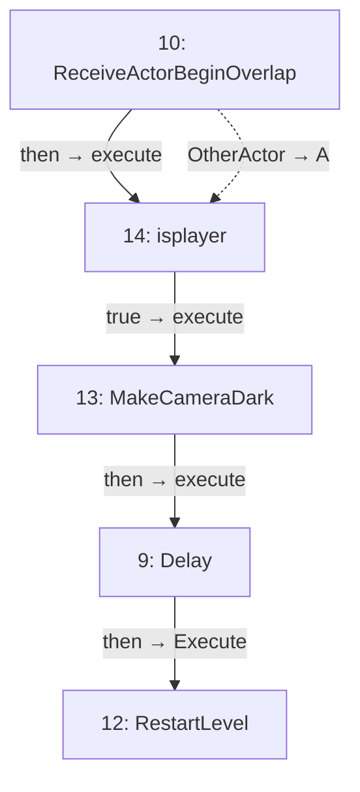

# BP_falltriger

Fall detection and restart.

[Back to walkthrough](README.md) · [Open Blueprint asset](../../Content/blueprints/props/BP_falltriger.uasset)

The node IDs below are export indices in this saved asset. Diagrams are reconstructed from serialized Blueprint pin links, not Unreal Editor screenshots. Solid arrows show execution; dotted arrows show data. Empty event nodes remain visible in the tables.

## EventGraph

| ID | Node | Connected inputs and stored defaults | Outputs |
| --- | --- | --- | --- |
| 9 | `Delay` | `execute` ← #13 `then` `Duration` = `1.000000` | `then` → #12 `Execute` |
| 10 | `ReceiveActorBeginOverlap` | — | `then` → #14 `execute` `OtherActor` → #14 `A` |
| 12 | `RestartLevel` | `Execute` ← #9 `then` | Unconnected |
| 13 | `MakeCameraDark` | `execute` ← #14 `true` `ToAlpha` = `1.000000` `Duration` = `1.000000` `bHoldWhenFinished` = `true` | `then` → #9 `execute` |
| 14 | `isplayer` | `execute` ← #10 `then` `A` ← #10 `OtherActor` | `true` → #13 `execute` |

## UserConstructionScript

No connected node flow in this graph.

| ID | Node | Connected inputs and stored defaults | Outputs |
| --- | --- | --- | --- |
| 11 | `UserConstructionScript` | — | Unconnected |

## Reading this export

A connected input gets its value from the linked node; its unused editor default is not shown in the table. Class defaults can be overridden by placed actors in a map. A disconnected output does not execute another node. This is a static graph inspection, not a runtime test.
