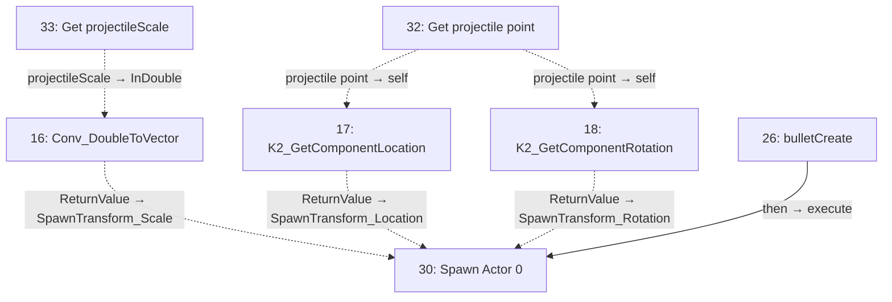
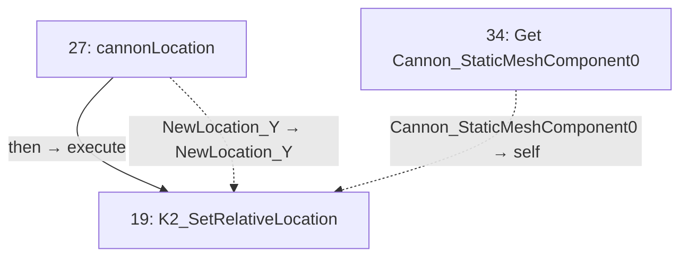
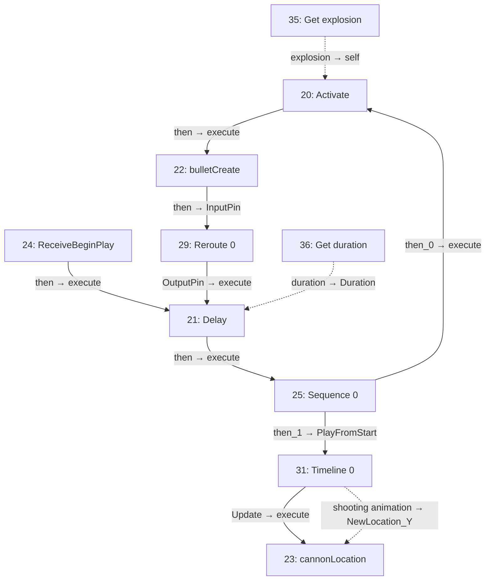

# Cannon_Blueprint

Repeated cannon firing and recoil animation.

[Back to walkthrough](README.md) · [Open Blueprint asset](../../Content/blueprints/props/Model_Cannon/Cannon_Blueprint.uasset)

The node IDs below are export indices in this saved asset. Diagrams are reconstructed from serialized Blueprint pin links, not Unreal Editor screenshots. Solid arrows show execution; dotted arrows show data. Empty event nodes remain visible in the tables.

## bulletCreate

| ID | Node | Connected inputs and stored defaults | Outputs |
| --- | --- | --- | --- |
| 16 | `Conv_DoubleToVector` | `InDouble` ← #33 `projectileScale` | `ReturnValue` → #30 `SpawnTransform_Scale` |
| 17 | `K2_GetComponentLocation` | `self` ← #32 `projectile point` | `ReturnValue` → #30 `SpawnTransform_Location` |
| 18 | `K2_GetComponentRotation` | `self` ← #32 `projectile point` | `ReturnValue` → #30 `SpawnTransform_Rotation` |
| 26 | `bulletCreate` | — | `then` → #30 `execute` |
| 30 | `Spawn Actor 0` | `execute` ← #26 `then` `Class` = `cannon_bullet_C` `SpawnTransform_Location` ← #17 `ReturnValue` `SpawnTransform_Rotation` ← #18 `ReturnValue` `SpawnTransform_Scale` ← #16 `ReturnValue` `CollisionHandlingOverride` = `Undefined` `TransformScaleMethod` = `MultiplyWithRoot` | Unconnected |
| 32 | `Get projectile point` | — | `projectile point` → #17 `self`, #18 `self` |
| 33 | `Get projectileScale` | — | `projectileScale` → #16 `InDouble` |

## cannonLocation

| ID | Node | Connected inputs and stored defaults | Outputs |
| --- | --- | --- | --- |
| 19 | `K2_SetRelativeLocation` | `execute` ← #27 `then` `self` ← #34 `Cannon_StaticMeshComponent0` `NewLocation` = `0, 0, 0` `NewLocation_X` = `0.0` `NewLocation_Y` ← #27 `NewLocation_Y` `NewLocation_Z` = `0.0` `bSweep` = `false` `bTeleport` = `false` | Unconnected |
| 27 | `cannonLocation` | — | `then` → #19 `execute` `NewLocation_Y` → #19 `NewLocation_Y` |
| 34 | `Get Cannon_StaticMeshComponent0` | — | `Cannon_StaticMeshComponent0` → #19 `self` |

## EventGraph

| ID | Node | Connected inputs and stored defaults | Outputs |
| --- | --- | --- | --- |
| 20 | `Activate` | `execute` ← #25 `then_0` `self` ← #35 `explosion` `bReset` = `true` | `then` → #22 `execute` |
| 21 | `Delay` | `execute` ← #24 `then`, #29 `OutputPin` `Duration` ← #36 `duration` | `then` → #25 `execute` |
| 22 | `bulletCreate` | `execute` ← #20 `then` | `then` → #29 `InputPin` |
| 23 | `cannonLocation` | `execute` ← #31 `Update` `NewLocation_Y` ← #31 `shooting animation` | Unconnected |
| 24 | `ReceiveBeginPlay` | — | `then` → #21 `execute` |
| 25 | `Sequence 0` | `execute` ← #21 `then` | `then_0` → #20 `execute` `then_1` → #31 `PlayFromStart` |
| 29 | `Reroute 0` | `InputPin` ← #22 `then` | `OutputPin` → #21 `execute` |
| 31 | `Timeline 0` | `PlayFromStart` ← #25 `then_1` `NewTime` = `0.0` | `Update` → #23 `execute` `shooting animation` → #23 `NewLocation_Y` |
| 35 | `Get explosion` | — | `explosion` → #20 `self` |
| 36 | `Get duration` | — | `duration` → #21 `Duration` |

## UserConstructionScript

No connected node flow in this graph.

| ID | Node | Connected inputs and stored defaults | Outputs |
| --- | --- | --- | --- |
| 28 | `UserConstructionScript` | — | Unconnected |

## Reading this export

A connected input gets its value from the linked node; its unused editor default is not shown in the table. Class defaults can be overridden by placed actors in a map. A disconnected output does not execute another node. This is a static graph inspection, not a runtime test.
