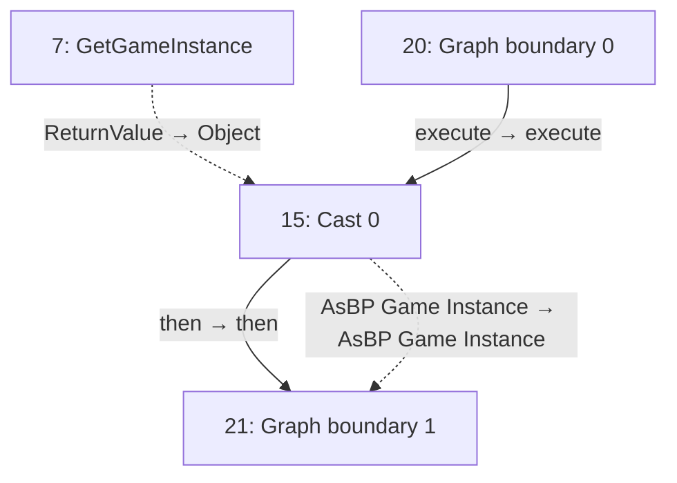
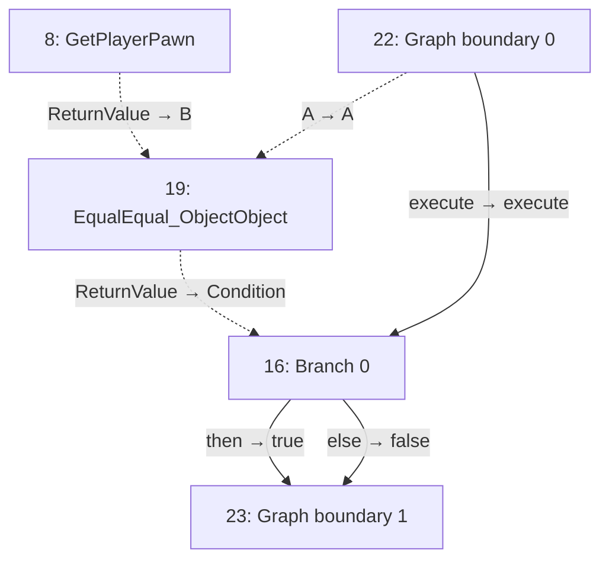
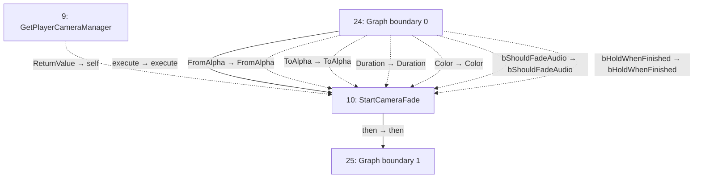
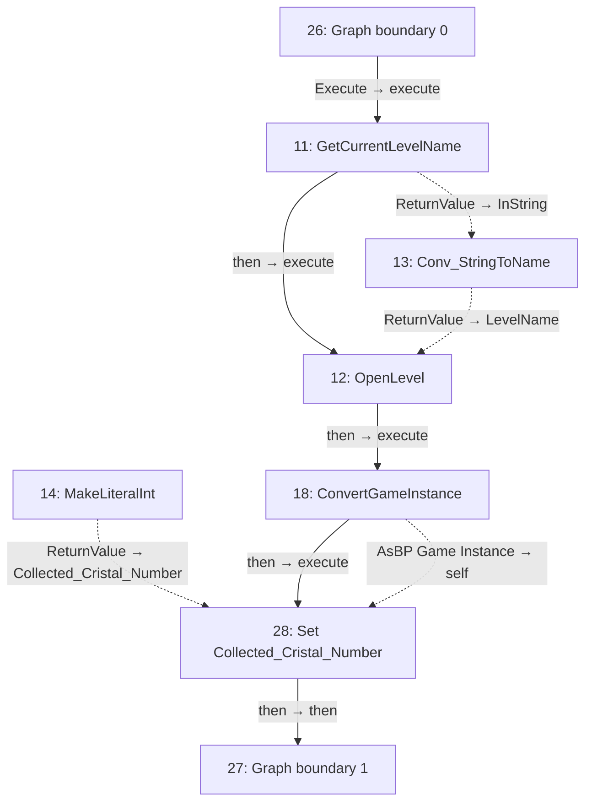

# NewMacroLibrary

Shared player checks, camera fades and restart logic.

[Back to walkthrough](README.md) · [Open Blueprint asset](../../Content/blueprints/props/NewMacroLibrary.uasset)

The node IDs below are export indices in this saved asset. Diagrams are reconstructed from serialized Blueprint pin links, not Unreal Editor screenshots. Solid arrows show execution; dotted arrows show data. Empty event nodes remain visible in the tables.

## ConvertGameInstance

| ID | Node | Connected inputs and stored defaults | Outputs |
| --- | --- | --- | --- |
| 7 | `GetGameInstance` | — | `ReturnValue` → #15 `Object` |
| 15 | `Cast 0` | `execute` ← #20 `execute` `Object` ← #7 `ReturnValue` | `then` → #21 `then` `AsBP Game Instance` → #21 `AsBP Game Instance` |
| 20 | `Graph boundary 0` | — | `execute` → #15 `execute` |
| 21 | `Graph boundary 1` | `then` ← #15 `then` `AsBP Game Instance` ← #15 `AsBP Game Instance` | Unconnected |

## isplayer

| ID | Node | Connected inputs and stored defaults | Outputs |
| --- | --- | --- | --- |
| 8 | `GetPlayerPawn` | `PlayerIndex` = `0` | `ReturnValue` → #19 `B` |
| 16 | `Branch 0` | `execute` ← #22 `execute` `Condition` ← #19 `ReturnValue` | `then` → #23 `true` `else` → #23 `false` |
| 19 | `EqualEqual_ObjectObject` | `A` ← #22 `A` `B` ← #8 `ReturnValue` | `ReturnValue` → #16 `Condition` |
| 22 | `Graph boundary 0` | — | `execute` → #16 `execute` `A` → #19 `A` |
| 23 | `Graph boundary 1` | `true` ← #16 `then` `false` ← #16 `else` | Unconnected |

## MakeCameraDark

| ID | Node | Connected inputs and stored defaults | Outputs |
| --- | --- | --- | --- |
| 9 | `GetPlayerCameraManager` | `PlayerIndex` = `0` | `ReturnValue` → #10 `self` |
| 10 | `StartCameraFade` | `execute` ← #24 `execute` `self` ← #9 `ReturnValue` `FromAlpha` ← #24 `FromAlpha` `ToAlpha` ← #24 `ToAlpha` `Duration` ← #24 `Duration` `Color` ← #24 `Color` `bShouldFadeAudio` ← #24 `bShouldFadeAudio` `bHoldWhenFinished` ← #24 `bHoldWhenFinished` | `then` → #25 `then` |
| 17 | `RestartLevel` | — | Unconnected |
| 24 | `Graph boundary 0` | — | `execute` → #10 `execute` `FromAlpha` → #10 `FromAlpha` `ToAlpha` → #10 `ToAlpha` `Duration` → #10 `Duration` `Color` → #10 `Color` `bShouldFadeAudio` → #10 `bShouldFadeAudio` `bHoldWhenFinished` → #10 `bHoldWhenFinished` |
| 25 | `Graph boundary 1` | `then` ← #10 `then` | Unconnected |

## RestartLevel

| ID | Node | Connected inputs and stored defaults | Outputs |
| --- | --- | --- | --- |
| 11 | `GetCurrentLevelName` | `execute` ← #26 `Execute` `bRemovePrefixString` = `true` | `then` → #12 `execute` `ReturnValue` → #13 `InString` |
| 12 | `OpenLevel` | `execute` ← #11 `then` `LevelName` ← #13 `ReturnValue` `bAbsolute` = `true` | `then` → #18 `execute` |
| 13 | `Conv_StringToName` | `InString` ← #11 `ReturnValue` | `ReturnValue` → #12 `LevelName` |
| 14 | `MakeLiteralInt` | `Value` = `0` | `ReturnValue` → #28 `Collected_Cristal_Number` |
| 18 | `ConvertGameInstance` | `execute` ← #12 `then` | `then` → #28 `execute` `AsBP Game Instance` → #28 `self` |
| 26 | `Graph boundary 0` | — | `Execute` → #11 `execute` |
| 27 | `Graph boundary 1` | `then` ← #28 `then` | Unconnected |
| 28 | `Set Collected_Cristal_Number` | `execute` ← #18 `then` `Collected_Cristal_Number` ← #14 `ReturnValue` `self` ← #18 `AsBP Game Instance` | `then` → #27 `then` |

## Reading this export

A connected input gets its value from the linked node; its unused editor default is not shown in the table. Class defaults can be overridden by placed actors in a map. A disconnected output does not execute another node. This is a static graph inspection, not a runtime test.
