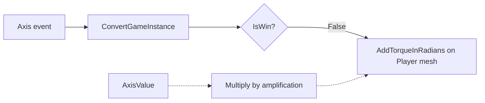
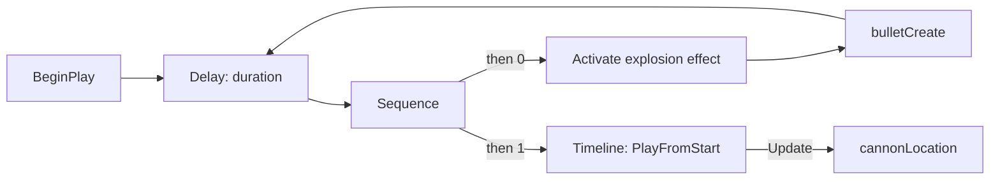
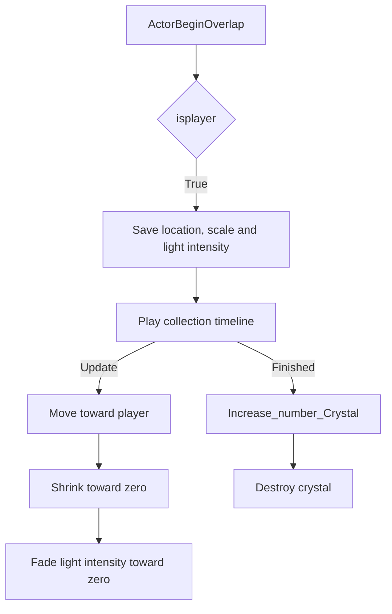
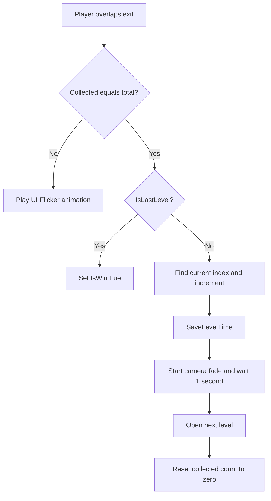

# Blueprint walkthrough

Small Ball Adventure is a rolling-ball obstacle course built with Unreal Engine 5.5 Blueprints. Move through the level, avoid cannon fire, collect every crystal, and reach the exit. This guide follows the saved gameplay graphs so the implementation can be reviewed without downloading Unreal Engine.

**Start with [player controls](#player-controls), [cannons](#cannons-and-projectiles), and [crystal collection](#crystal-collection).** Each section links to a complete node reference with execution diagrams, data connections and input values. [中文阅读指南](../PROJECT-GUIDE-ZH.md) explains the files and main systems in Chinese.

These diagrams are reconstructed from the actual `.uasset` node and pin data. They are not screenshots of the Blueprint editor. The [level screenshots](../../README.md#screenshots) and [gameplay video](https://youtu.be/G0ebrOazVws) show the project visually.

## Player controls

**Asset: [BA_Player](BA_Player.md)**

The ball moves through physics torque rather than direct position changes. Both input paths first read `IsWin` from `BP_GameInstance`. The **False** branch allows movement; the True branch has no movement connection.

| Input | Data calculation | Physics node |
| --- | --- | --- |
| `Move_Horrizontal` (A = -1, D = +1) | `AxisValue × amplification` | `AddTorqueInRadians`, X component |
| `Move_Vertical` (W = -1, S = +1) | `AxisValue × amplification` | `AddTorqueInRadians`, Y component |

The saved class default for `amplification` is **30**. Both torque nodes target the `Player` mesh and set `bAccelChange = true`. The axis names retain their original spelling to make them easy to find in the editor.

Other player paths:

- **BeginPlay:** start a one-second fade from black, create `BP_UI`, then add it to the viewport. The fade starts asynchronously; widget creation does not wait for it to finish.
- **AnyDamage:** fade to black over one second, wait one second, then call `RestartLevel`. This is a restart-on-damage system, not a health-bar system; the event's damage amount is not used.
- **Tick:** read `IsWin`; when it is true, pass through `DoOnce` and disable physics on the ball. Together with the input branches, this stops the ball after victory.
- **Escape:** call `QuitGame`.
- **`pointView` function:** accept an arm length and rotation, set the spring arm's `TargetArmLength`, then set its world rotation. This gives external callers one place to adjust the camera. The stored spring-arm length is 800; this walkthrough does not establish every map call site.

## Cannons and projectiles

**Assets: [Cannon_Blueprint](Cannon_Blueprint.md) · [cannon_bullet](cannon_bullet.md)**

The cannons fire automatically. The player is avoiding these projectiles, not firing them.

1. `Delay` reads the `duration` variable; its saved class default is **12 seconds**. Individual level instances may use other values.
2. `Sequence` starts the effect/spawn path and the recoil timeline. These are ordered execution outputs, not separate threads.
3. `bulletCreate` reads the `projectile point` component's world location and rotation, converts `projectileScale` to a uniform scale vector, and spawns `cannon_bullet` with that transform. The saved scale default is **1**.
4. The spawn path reconnects to `Delay`, creating the firing loop.
5. On each recoil timeline update, `shooting animation` supplies the Y value to `cannonLocation`. That function sets the cannon mesh's relative location, with X and Z set to zero in the saved graph.

The bullet's `ProjectileMovement` component stores initial and maximum speeds of **400**, with a gravity scale of **0**. On `ReceiveHit`, the graph calls `DestroyActor`, compares `Other` with player pawn 0, and applies **1 damage** to the player only on a match. That damage reaches the player's restart path described above. The node reference preserves the existing destroy-before-check order.

## Crystal collection

**Assets: [BP_cristal](BP_cristal.md) · [BP_GameInstance](BP_GameInstance.md)**

The collectible has three animation tracks rather than disappearing immediately on overlap.

- `isplayer` compares the overlapping actor with player pawn 0. Other actors do not enter the collection path.
- The collapsed setup graph saves `startLocation`, the current actor scale, and the point light's intensity.
- `get location` uses `VLerp` between the saved start position and the player's **current** location. Its output feeds `SetActorLocation`, so the destination can follow a moving ball.
- `scale_animation` uses `VLerp` from the saved scale to a zero vector and passes the result to `SetActorScale3D`.
- `intensity_animation` uses a scalar `Lerp` from the saved intensity to zero and calls `SetIntensity` on the point light.
- When the timeline finishes, `Increase_number_Crystal` increments `Collected_Cristal_Number` in the game instance, then the crystal destroys itself.

Counting happens at animation completion. Merely entering the crystal's overlap does not immediately increment the counter.

## Exit checks and level progression

**Asset: [Success_trigger](Success_trigger.md)**

At BeginPlay, the exit counts all `BP_cristal` actors with `GetAllActorsOfClass` and `Array_Length`, then stores the result in `AllCristalNumber`.

The saved `LevelNameList` is `ball_adventure_project`, then `level_2`. `GetCurrentLevelIndex` finds the current map name in this list. `IsLastLevel` compares that index with the array's last index.

If crystals are missing, the graph finds a `BP_UI` widget and calls `PlayFlicerAnimation` to give feedback. If all crystals are collected, the final level sets `IsWin = true`; otherwise the graph selects the next name, saves the UI timer into the game instance, starts a fade, waits, and opens that map. The existing graph resets the collected count after `OpenLevel` on its execution chain.

## UI and shared state

**Assets: [BP_UI](BP_UI.md) · [BP_GameInstance](BP_GameInstance.md)**

| Value or function | How it is used |
| --- | --- |
| `Collected_Cristal_Number` | Incremented when a crystal's animation finishes; read by the counter and exit check |
| `AllCristalNumber` | Set from the number of crystals in the current map |
| `IsWin` | Gates player input, stops physics and timer updates, and controls win-text visibility |
| `GameTime` | Holds the time copied from the UI when advancing to another level |
| `LevelTime` (UI) | Initialized from `GameTime`, then increased by `InDeltaTime` while `IsWin` is false |
| `Get_CrystalCollected_Text` | Converts the two counts to strings and joins them as `collected/total` |
| `Get_TimeText_Text` | Formats `LevelTime` with `TimeSecondsToString` and prefixes it with `Time: ` |
| `Get_WINTEXT_Visibility` | Returns Visible when `IsWin` is true, Hidden otherwise |
| `PlayFlicerAnimation` | Plays the `Flicker` widget animation once |

Despite its name, `LevelTime` can include time from earlier levels because it starts from `GameTime`. The game instance is shared during the running session; no disk save/load system is shown in these Blueprints.

## Falls, camera fades and reusable macros

**Assets: [BP_falltriger](BP_falltriger.md) · [NewMacroLibrary](NewMacroLibrary.md)**

`BP_falltriger` checks whether the overlapping actor is the player, starts a one-second fade to black, waits one second, and restarts the current level.

The shared macro library contains:

| Macro | Internal nodes and purpose |
| --- | --- |
| `isplayer` | `GetPlayerPawn(0)` → object equality → Branch; exposes True and False execution outputs |
| `ConvertGameInstance` | `GetGameInstance` → cast to `BP_GameInstance`; exposes the successful cast and object reference |
| `MakeCameraDark` | `GetPlayerCameraManager(0)` → `StartCameraFade`; forwards alpha, duration, color, audio and hold settings |
| `RestartLevel` | Get current map name → convert string to name → `OpenLevel` → access game instance → set collected count to 0 |

The fade macro itself does not wait. The callers use a separate `Delay` before restarting or changing maps. There is also an unconnected `RestartLevel` macro node inside `MakeCameraDark`; it does not participate in that macro's execution flow.

## Following spotlight

**Asset: [BP_Spotlight_follow](BP_Spotlight_follow.md)**

Player-only BeginOverlap and EndOverlap events toggle `IsPlayerOverlapping`. Tick reads that flag. While it is true, `FindLookAtRotation` calculates a rotation from the spotlight's position toward the player. `RInterpTo` blends from the current rotation using `DeltaSeconds` and a saved interpolation speed of **5**, then `SetWorldRotation` applies it to the spotlight. Leaving the overlap stops these rotation updates.

## Game mode and practice assets

[BA_game_mode](BA_game_mode.md) sets `BA_Player` as its default pawn. Its event nodes are unconnected; the class setting is its main contribution.

[BP_cube_hit](BP_cube_hit.md) and [bullit_Blueprint](bullit_Blueprint.md) are retained as practice assets. Their saved BeginPlay, overlap and Tick nodes have no execution connections. They should not be confused with the implemented `cannon_bullet` hit logic.

## Review notes and next improvements

The current graphs have been inspected statically. The following are follow-up work, not completed fixes:

- Add a collection guard or disable overlap once a crystal starts its animation, then test rapid exit/re-entry before the animation finishes.
- Validate widget array element 0 before calling it, and handle a current map name that is missing from `LevelNameList`.
- Reset shared state explicitly before level travel, then test retry, next-level and fresh-run behavior. The current reset nodes follow `OpenLevel`.
- Consider notifying the player and UI when win state changes instead of checking it every Tick.
- Review the projectile's physics and movement-component combination, and test collision handling at different frame rates before changing it.

## Inspection method

The reference pages cover **13 assets, 257 K2 nodes, 885 pins and 256 connections**. Every exported connection was checked for a matching link at its other end and opposite pin directions. Source asset hashes are recorded in [asset-manifest.json](asset-manifest.json).

Package properties were read with [UAssetAPI](https://github.com/atenfyr/UAssetAPI). Pin serialization was decoded against the locally installed UE 5.5 `EdGraphPin.cpp` format. Node-specific trailing data and timeline curve keyframes are not presented as a full asset decompilation. Map-instance overrides, full dependency loading, and runtime behavior have not been re-tested by this documentation pass. The source Blueprint files were copied without modification.
