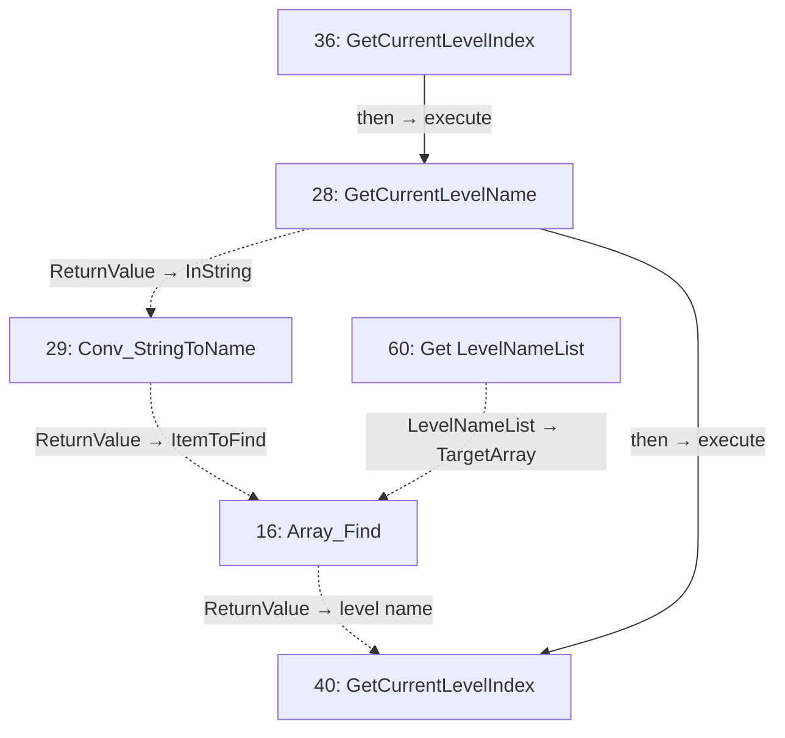
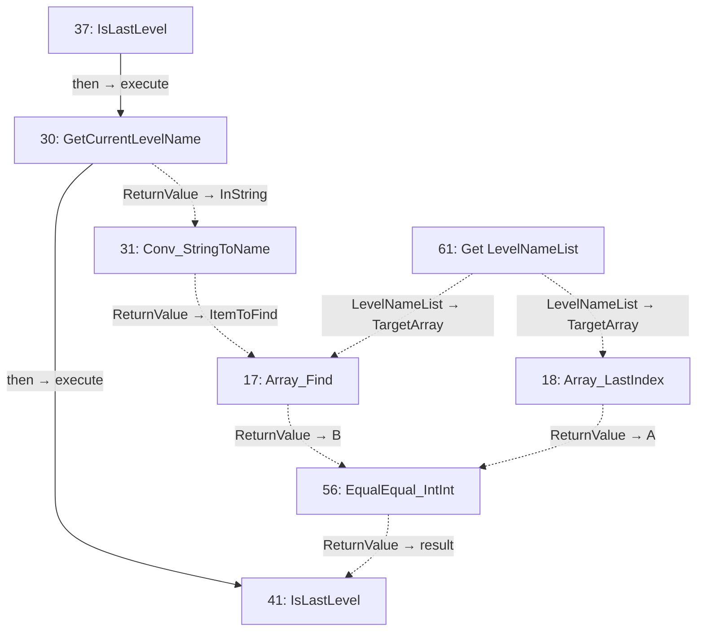
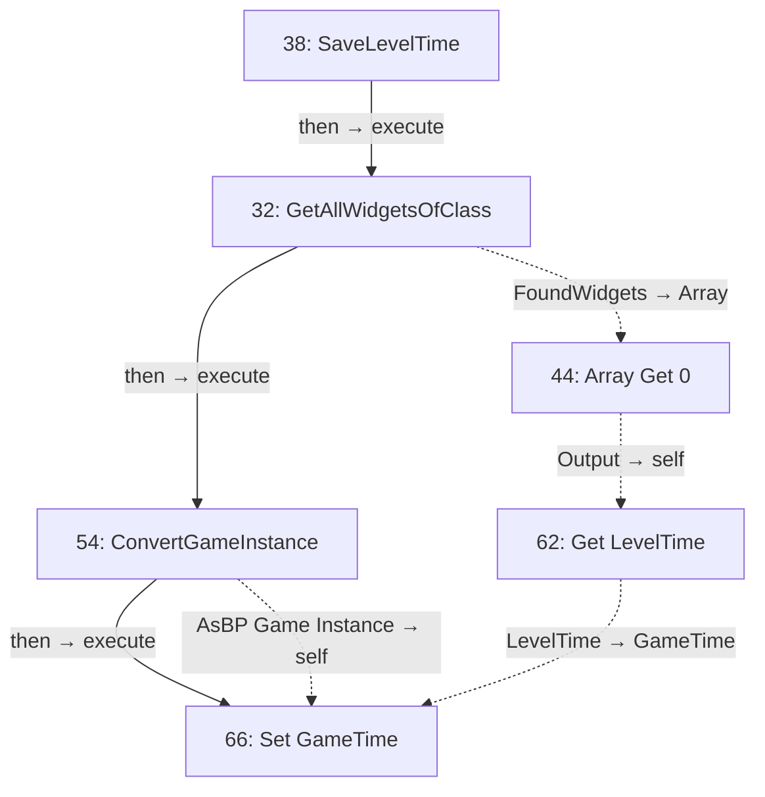

# Success_trigger

Collection gate, level progression and final victory.

[Back to walkthrough](README.md) · [Open Blueprint asset](../../Content/blueprints/props/Success_trigger.uasset)

The node IDs below are export indices in this saved asset. Diagrams are reconstructed from serialized Blueprint pin links, not Unreal Editor screenshots. Solid arrows show execution; dotted arrows show data. Empty event nodes remain visible in the tables.

## EventGraph

```mermaid
flowchart TD
  n15["15: Array_Length"]
  n19["19: Delay"]
  n20["20: MakeLiteralDouble"]
  n21["21: OpenLevel"]
  n22["22: GetAllWidgetsOfClass"]
  n23["23: GetAllActorsOfClass"]
  n24["24: PlayFlicerAnimation"]
  n25["25: IsLastLevel"]
  n26["26: GetCurrentLevelIndex"]
  n27["27: SaveLevelTime"]
  n33["33: ReceiveActorBeginOverlap"]
  n35["35: ReceiveBeginPlay"]
  n42["42: Array Get 0"]
  n43["43: Array Get 1"]
  n45["45: Branch 0"]
  n46["46: Branch 2"]
  n47["47: ConvertGameInstance"]
  n48["48: ConvertGameInstance"]
  n49["49: MakeCameraDark"]
  n50["50: IncrementInt"]
  n51["51: ConvertGameInstance"]
  n52["52: ConvertGameInstance"]
  n53["53: isplayer"]
  n55["55: EqualEqual_IntInt"]
  n57["57: Get AllCristalNumber"]
  n58["58: Get Collected_Cristal_Number"]
  n59["59: Get LevelNameList"]
  n63["63: Set IsWin"]
  n64["64: Set AllCristalNumber"]
  n65["65: Set Collected_Cristal_Number"]
  n15 -.->|"ReturnValue → AllCristalNumber"| n64
  n19 -->|"then → execute"| n21
  n20 -.->|"ReturnValue → Duration"| n49
  n20 -.->|"ReturnValue → Duration"| n19
  n21 -->|"then → execute"| n52
  n22 -->|"then → execute"| n24
  n22 -.->|"FoundWidgets → Array"| n43
  n23 -->|"then → execute"| n48
  n23 -.->|"OutActors → TargetArray"| n15
  n25 -->|"then → execute"| n46
  n25 -.->|"result → Condition"| n46
  n26 -->|"then →  "| n50
  n26 -.->|"level name → Value"| n50
  n27 -->|"then → execute"| n49
  n33 -->|"then → execute"| n53
  n33 -.->|"OtherActor → A"| n53
  n35 -->|"then → execute"| n23
  n42 -.->|"Output → LevelName"| n21
  n43 -.->|"Output → self"| n24
  n45 -->|"then → execute"| n25
  n45 -->|"else → execute"| n22
  n46 -->|"then → execute"| n51
  n46 -->|"else → execute"| n26
  n47 -->|"then → execute"| n45
  n47 -.->|"AsBP Game Instance → self"| n57
  n47 -.->|"AsBP Game Instance → self"| n58
  n48 -->|"then → execute"| n64
  n48 -.->|"AsBP Game Instance → self"| n64
  n49 -->|"then → execute"| n19
  n50 -->|"   → execute"| n27
  n50 -.->|"Result → Dimension 1"| n42
  n51 -->|"then → execute"| n63
  n51 -.->|"AsBP Game Instance → self"| n63
  n52 -->|"then → execute"| n65
  n52 -.->|"AsBP Game Instance → self"| n65
  n53 -->|"true → execute"| n47
  n55 -.->|"ReturnValue → Condition"| n45
  n57 -.->|"AllCristalNumber → A"| n55
  n58 -.->|"Collected_Cristal_Number → B"| n55
  n59 -.->|"LevelNameList → Array"| n42
```

| ID | Node | Connected inputs and stored defaults | Outputs |
| --- | --- | --- | --- |
| 15 | `Array_Length` | `TargetArray` ← #23 `OutActors` | `ReturnValue` → #64 `AllCristalNumber` |
| 19 | `Delay` | `execute` ← #49 `then` `Duration` ← #20 `ReturnValue` | `then` → #21 `execute` |
| 20 | `MakeLiteralDouble` | `Value` = `1.000000` | `ReturnValue` → #49 `Duration`, #19 `Duration` |
| 21 | `OpenLevel` | `execute` ← #19 `then` `LevelName` ← #42 `Output` `bAbsolute` = `true` | `then` → #52 `execute` |
| 22 | `GetAllWidgetsOfClass` | `execute` ← #45 `else` `WidgetClass` = `BP_UI_C` `TopLevelOnly` = `true` | `then` → #24 `execute` `FoundWidgets` → #43 `Array` |
| 23 | `GetAllActorsOfClass` | `execute` ← #35 `then` `ActorClass` = `BP_cristal_C` | `then` → #48 `execute` `OutActors` → #15 `TargetArray` |
| 24 | `PlayFlicerAnimation` | `execute` ← #22 `then` `self` ← #43 `Output` | Unconnected |
| 25 | `IsLastLevel` | `execute` ← #45 `then` | `then` → #46 `execute` `result` → #46 `Condition` |
| 26 | `GetCurrentLevelIndex` | `execute` ← #46 `else` | `then` → #50 ` ` `level name` → #50 `Value` |
| 27 | `SaveLevelTime` | `execute` ← #50 `  ` | `then` → #49 `execute` |
| 33 | `ReceiveActorBeginOverlap` | — | `then` → #53 `execute` `OtherActor` → #53 `A` |
| 34 | `ReceiveTick` | — | Unconnected |
| 35 | `ReceiveBeginPlay` | — | `then` → #23 `execute` |
| 42 | `Array Get 0` | `Array` ← #59 `LevelNameList` `Dimension 1` ← #50 `Result` | `Output` → #21 `LevelName` |
| 43 | `Array Get 1` | `Array` ← #22 `FoundWidgets` `Dimension 1` = `0` | `Output` → #24 `self` |
| 45 | `Branch 0` | `execute` ← #47 `then` `Condition` ← #55 `ReturnValue` | `then` → #25 `execute` `else` → #22 `execute` |
| 46 | `Branch 2` | `execute` ← #25 `then` `Condition` ← #25 `result` | `then` → #51 `execute` `else` → #26 `execute` |
| 47 | `ConvertGameInstance` | `execute` ← #53 `true` | `then` → #45 `execute` `AsBP Game Instance` → #57 `self`, #58 `self` |
| 48 | `ConvertGameInstance` | `execute` ← #23 `then` | `then` → #64 `execute` `AsBP Game Instance` → #64 `self` |
| 49 | `MakeCameraDark` | `execute` ← #27 `then` `Duration` ← #20 `ReturnValue` | `then` → #19 `execute` |
| 50 | `IncrementInt` | ` ` ← #26 `then` `Value` ← #26 `level name` | `  ` → #27 `execute` `Result` → #42 `Dimension 1` |
| 51 | `ConvertGameInstance` | `execute` ← #46 `then` | `then` → #63 `execute` `AsBP Game Instance` → #63 `self` |
| 52 | `ConvertGameInstance` | `execute` ← #21 `then` | `then` → #65 `execute` `AsBP Game Instance` → #65 `self` |
| 53 | `isplayer` | `execute` ← #33 `then` `A` ← #33 `OtherActor` | `true` → #47 `execute` |
| 55 | `EqualEqual_IntInt` | `A` ← #57 `AllCristalNumber` `B` ← #58 `Collected_Cristal_Number` | `ReturnValue` → #45 `Condition` |
| 57 | `Get AllCristalNumber` | `self` ← #47 `AsBP Game Instance` | `AllCristalNumber` → #55 `A` |
| 58 | `Get Collected_Cristal_Number` | `self` ← #47 `AsBP Game Instance` | `Collected_Cristal_Number` → #55 `B` |
| 59 | `Get LevelNameList` | — | `LevelNameList` → #42 `Array` |
| 63 | `Set IsWin` | `execute` ← #51 `then` `IsWin` = `true` `self` ← #51 `AsBP Game Instance` | Unconnected |
| 64 | `Set AllCristalNumber` | `execute` ← #48 `then` `AllCristalNumber` ← #15 `ReturnValue` `self` ← #48 `AsBP Game Instance` | Unconnected |
| 65 | `Set Collected_Cristal_Number` | `execute` ← #52 `then` `Collected_Cristal_Number` = `0` `self` ← #52 `AsBP Game Instance` | Unconnected |

## GetCurrentLevelIndex

| ID | Node | Connected inputs and stored defaults | Outputs |
| --- | --- | --- | --- |
| 16 | `Array_Find` | `TargetArray` ← #60 `LevelNameList` `ItemToFind` ← #29 `ReturnValue` | `ReturnValue` → #40 `level name` |
| 28 | `GetCurrentLevelName` | `execute` ← #36 `then` `bRemovePrefixString` = `true` | `then` → #40 `execute` `ReturnValue` → #29 `InString` |
| 29 | `Conv_StringToName` | `InString` ← #28 `ReturnValue` | `ReturnValue` → #16 `ItemToFind` |
| 36 | `GetCurrentLevelIndex` | — | `then` → #28 `execute` |
| 40 | `GetCurrentLevelIndex` | `execute` ← #28 `then` `level name` ← #16 `ReturnValue` | Unconnected |
| 60 | `Get LevelNameList` | — | `LevelNameList` → #16 `TargetArray` |

## IsLastLevel

| ID | Node | Connected inputs and stored defaults | Outputs |
| --- | --- | --- | --- |
| 17 | `Array_Find` | `TargetArray` ← #61 `LevelNameList` `ItemToFind` ← #31 `ReturnValue` | `ReturnValue` → #56 `B` |
| 18 | `Array_LastIndex` | `TargetArray` ← #61 `LevelNameList` | `ReturnValue` → #56 `A` |
| 30 | `GetCurrentLevelName` | `execute` ← #37 `then` `bRemovePrefixString` = `true` | `then` → #41 `execute` `ReturnValue` → #31 `InString` |
| 31 | `Conv_StringToName` | `InString` ← #30 `ReturnValue` | `ReturnValue` → #17 `ItemToFind` |
| 37 | `IsLastLevel` | — | `then` → #30 `execute` |
| 41 | `IsLastLevel` | `execute` ← #30 `then` `result` ← #56 `ReturnValue` | Unconnected |
| 56 | `EqualEqual_IntInt` | `A` ← #18 `ReturnValue` `B` ← #17 `ReturnValue` | `ReturnValue` → #41 `result` |
| 61 | `Get LevelNameList` | — | `LevelNameList` → #17 `TargetArray`, #18 `TargetArray` |

## SaveLevelTime

| ID | Node | Connected inputs and stored defaults | Outputs |
| --- | --- | --- | --- |
| 32 | `GetAllWidgetsOfClass` | `execute` ← #38 `then` `WidgetClass` = `BP_UI_C` `TopLevelOnly` = `true` | `then` → #54 `execute` `FoundWidgets` → #44 `Array` |
| 38 | `SaveLevelTime` | — | `then` → #32 `execute` |
| 44 | `Array Get 0` | `Array` ← #32 `FoundWidgets` `Dimension 1` = `0` | `Output` → #62 `self` |
| 54 | `ConvertGameInstance` | `execute` ← #32 `then` | `then` → #66 `execute` `AsBP Game Instance` → #66 `self` |
| 62 | `Get LevelTime` | `self` ← #44 `Output` | `LevelTime` → #66 `GameTime` |
| 66 | `Set GameTime` | `execute` ← #54 `then` `GameTime` ← #62 `LevelTime` `self` ← #54 `AsBP Game Instance` | Unconnected |

## UserConstructionScript

No connected node flow in this graph.

| ID | Node | Connected inputs and stored defaults | Outputs |
| --- | --- | --- | --- |
| 39 | `UserConstructionScript` | — | Unconnected |

## Reading this export

A connected input gets its value from the linked node; its unused editor default is not shown in the table. Class defaults can be overridden by placed actors in a map. A disconnected output does not execute another node. This is a static graph inspection, not a runtime test.
