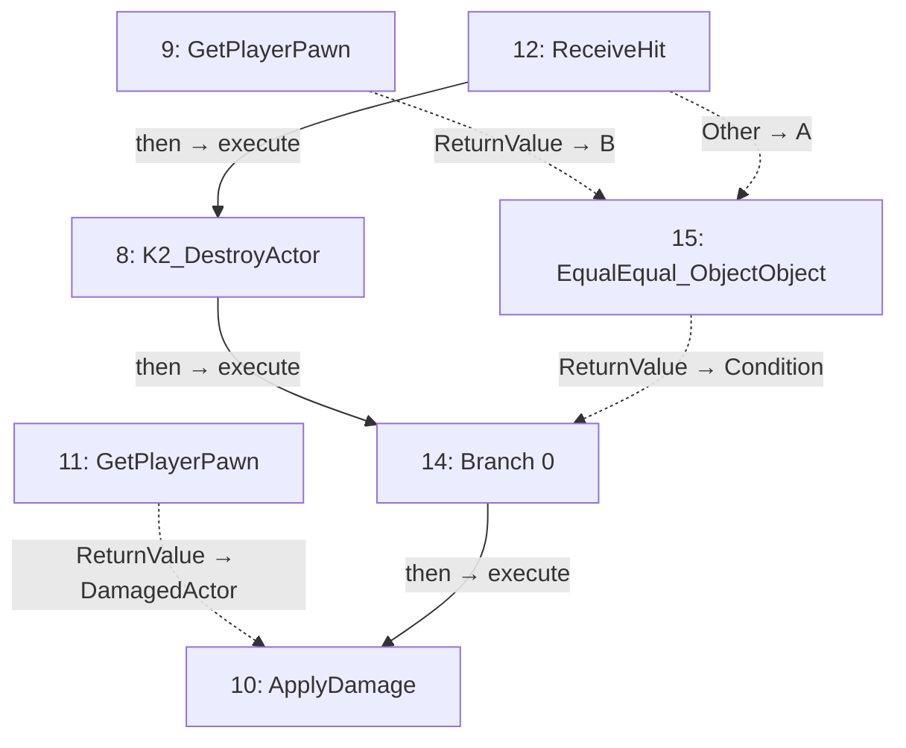

# cannon_bullet

Projectile movement and hit handling.

[Back to walkthrough](README.md) · [Open Blueprint asset](../../Content/blueprints/props/cannon_bullet.uasset)

The node IDs below are export indices in this saved asset. Diagrams are reconstructed from serialized Blueprint pin links, not Unreal Editor screenshots. Solid arrows show execution; dotted arrows show data. Empty event nodes remain visible in the tables.

## EventGraph

| ID | Node | Connected inputs and stored defaults | Outputs |
| --- | --- | --- | --- |
| 8 | `K2_DestroyActor` | `execute` ← #12 `then` | `then` → #14 `execute` |
| 9 | `GetPlayerPawn` | `PlayerIndex` = `0` | `ReturnValue` → #15 `B` |
| 10 | `ApplyDamage` | `execute` ← #14 `then` `DamagedActor` ← #11 `ReturnValue` `BaseDamage` = `1.000000` | Unconnected |
| 11 | `GetPlayerPawn` | `PlayerIndex` = `0` | `ReturnValue` → #10 `DamagedActor` |
| 12 | `ReceiveHit` | — | `then` → #8 `execute` `Other` → #15 `A` |
| 14 | `Branch 0` | `execute` ← #8 `then` `Condition` ← #15 `ReturnValue` | `then` → #10 `execute` |
| 15 | `EqualEqual_ObjectObject` | `A` ← #12 `Other` `B` ← #9 `ReturnValue` | `ReturnValue` → #14 `Condition` |

## UserConstructionScript

No connected node flow in this graph.

| ID | Node | Connected inputs and stored defaults | Outputs |
| --- | --- | --- | --- |
| 13 | `UserConstructionScript` | — | Unconnected |

## Reading this export

A connected input gets its value from the linked node; its unused editor default is not shown in the table. Class defaults can be overridden by placed actors in a map. A disconnected output does not execute another node. This is a static graph inspection, not a runtime test.
